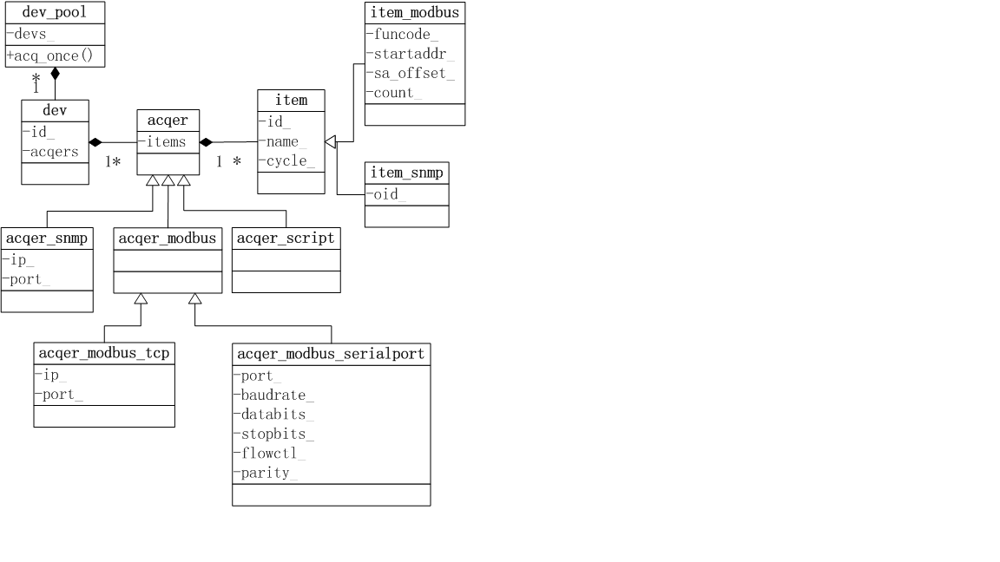

# DAQ #
## 一个工业设备的数据采集程序 ##
### 特点： ###
1. 高度封装、易扩展之其他各种协议：snmp、DTL645、自定义协议等；
2. 内建支持modbus协议，同时支持串口和tcp采集，可直接编译执行观察效果；
3. 采集点位的定义支持表达式计算，以应对复杂的二次计算；
4. c++语言编写，效率高，功耗低，单服务可同时支持万台设备的数据采集；
5. 服务在linux系统运行，暂时不支持windows；
6. 本项目所有代码均为开源，可自由引用、修改、投入生产。
### 设计思想 ###
以下是主要的类的uml图：

- `class dev_pool`： 设备池，单例，保存所有的设备类(dev),由主函数调用，并触发采集；  

- `class dev`: 设备类，对物理设备（电表、传感器等）的抽象，每个dev具有唯一id，并包含多个采集器类（acqer）；  

- `class acqer`: 抽象基类，每个acqer必须定义采集点位（item）（点位指每个采集值单位），具体采集方法由子类决定；

-  `class acqer_snmp`: snmp协议的采集器，负责snmp协议的采集；

- `class acqer_modbus`: modbus采集器，负责modbus协议设备的采集, 采集通道（tcp、串口）由子类决定；

- `class acqer_modbus_tcp`:  modbus协议的tcp采集器；

- `class acqer_modbus_serialport`:  modbus协议的串口采集器；

- `class item`：  采集点位类，采集数据的元单位，比如一个温度数据、一个电压数据等；

- `class item_modbus`：  modbus点位类，定义modbus协议参数，这些参数决定了采集的值；

- `class item_snmp`:  snmp协议点位类，定义采集snmp协议的参数。

### 采集配置 ###
示例：  
配置一个modbus设备的串口采集

    <device id="EleMeter01">
    	<acqer proto="modbus" devaddr=1 serialport=2 baudrate=9600 databits=8 stopbits=1 flowctl=0 parity=0>
    		<item id=1 name="cpu" cycle=5 funcode=3 startaddr=0 count=1 />
    		<item id=2 names="mem" cycle=10 funcode=3 startaddr=1 count=1 />
    		<item id=3 name="power" cycle=10 funcode=3 startaddr=3 count=1 offset=1 expr="$3+2"/>
    		<item id=4 name="voltage" cycle=10 valtype="float" expr="sqrt($2)" /> 
    	</acqer>
    </device>
### 表达式的配置：   ###
expr="sqrt($2)"
$n代表id=n的点位值，上面的表达式意思就是对id=2的点位值进平方根运算，作为id=4的点位值。

表达式计算在一些设备的数据采集中发挥不可替代的作用，比如有些型号的电表采集出来的电能需要经过二次计算才是真实的值。

目前表达式支持+-*/%,sqrt，abs，pow，sin，cos，lg，ln等运算，需要引用用eval库：[https://github.com/fdxuwei/](https://github.com/fdxuwei/)

### 其他协议的扩展 ###

1. 定义acqer的子类，实现simple_acq接口，该接口实现了数据的具体采集方法；
2. 定义item的子类，该子类包含新协议需要的参数，如没有新的参数，则不需要这一步；
3. 在配置文件里面添加相应协议的配置，并在main.cpp里面解析这些配置。